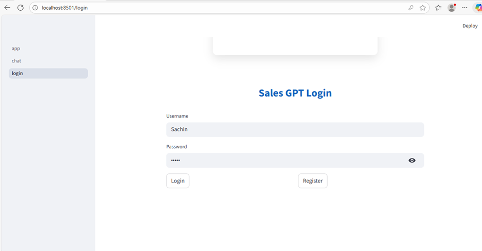
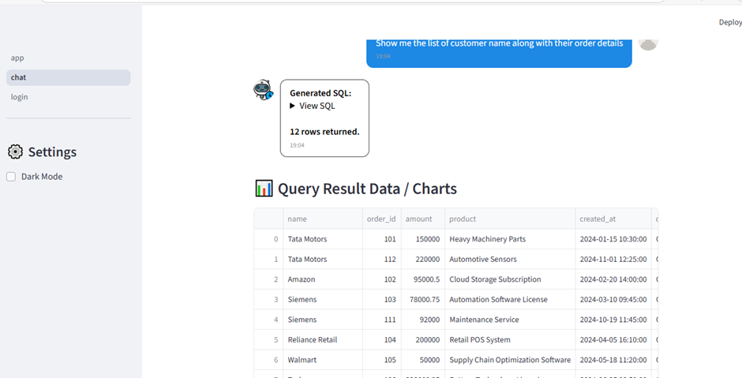
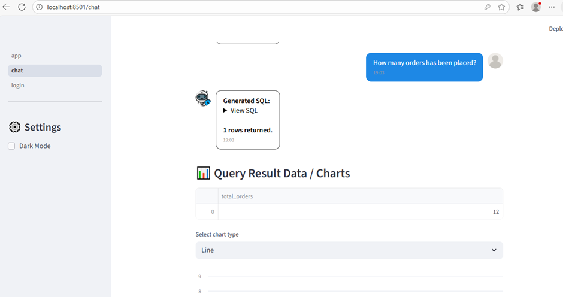
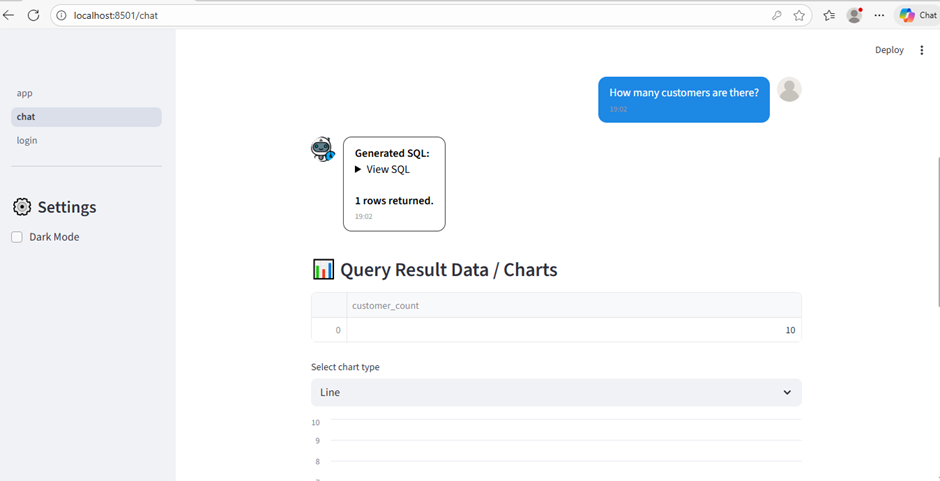
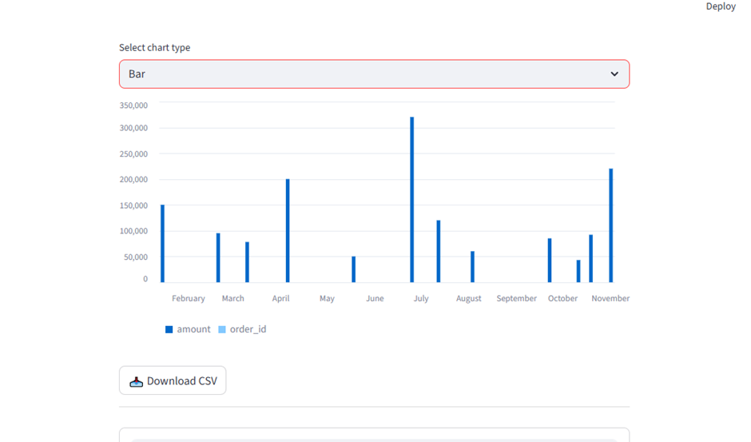

📈🤖 SalesBOT – AI-Powered Email Automation

SalesBOT is an AI-powered assistant that automates email processing, generates context-aware responses using AI, and integrates with a knowledge base for accurate answers. Built with Django, Streamlit, and MySQL, it simplifies sales and support workflows.

🚀 Features

📧 Automatic Email Processing – Fetch unread emails and extract user queries.

🧠 AI-Powered Responses – Use embeddings, RAG, and LLMs to generate accurate replies.

📚 Knowledge Base Integration – Search FAQs, documents, and internal resources.

⚡ Workflow Automation – Update email status (read/replied/pending) automatically.

🗃️ Analytics & Tracking – Store queries, responses, and confidence levels in MySQL.

👥 Multi-User Support – Handles multiple senders and queries simultaneously.

🛠 Tech Stack

     

📦 Project Structure
SALESBOT/
│
├── images/                  # Screenshots for README
├── salesbot/
│   ├── api/                 # API endpoints & backend logic
│   ├── salesbot/            # Django app modules
│   ├── streamlit/           # Streamlit frontend
│   │   ├── chat_data/       # User chat history
│   │   └── pages/           # Streamlit pages
│   │       ├── chat.py
│   │       └── login.py
│   │   └── app.py           # Streamlit main app
│   └── manage.py            # Django manage script
├── venv/                    # Virtual environment
└── README.md

🔧 Setup Instructions

1️⃣ Clone the repository

git clone https://github.com/<username>/<repo>.git
cd SALESBOT

2️⃣ Create & activate virtual environment

python -m venv venv
source venv/bin/activate     # Mac/Linux
venv\Scripts\activate        # Windows

3️⃣ Install dependencies

pip install -r requirements.txt

4️⃣ Run Django Backend

cd salesbot
python manage.py runserver

Backend runs at: http://127.0.0.1:8000/

5️⃣ Run Streamlit Frontend

streamlit run salesbot/streamlit/app.py

🖥️ How It Works

Fetch Emails: Reads unread emails using Microsoft Graph API.

Extract Queries: Parses email content to extract user queries.

Retrieve Knowledge: Performs similarity search on FAQs or documents using embeddings.

Generate Response: AI creates context-aware replies using RAG & LLM.

Send Reply: Sends email and updates status automatically.

Track & Analyze: Stores query, response, and confidence in MySQL.

📷 Screenshots

🎯 Use Cases

Automate customer support emails

Streamline sales workflow

Extract knowledge from internal documents

Track query-response analytics
